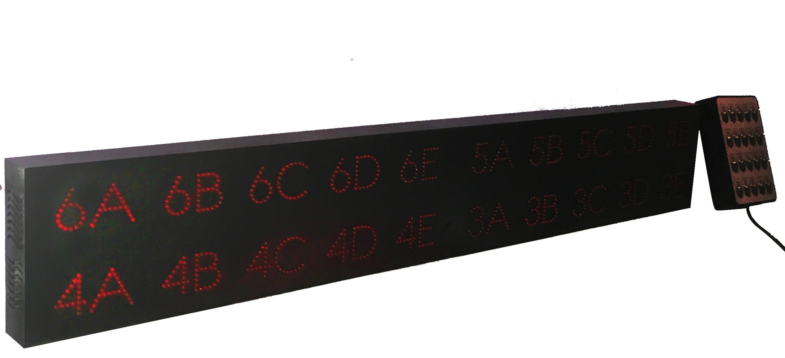
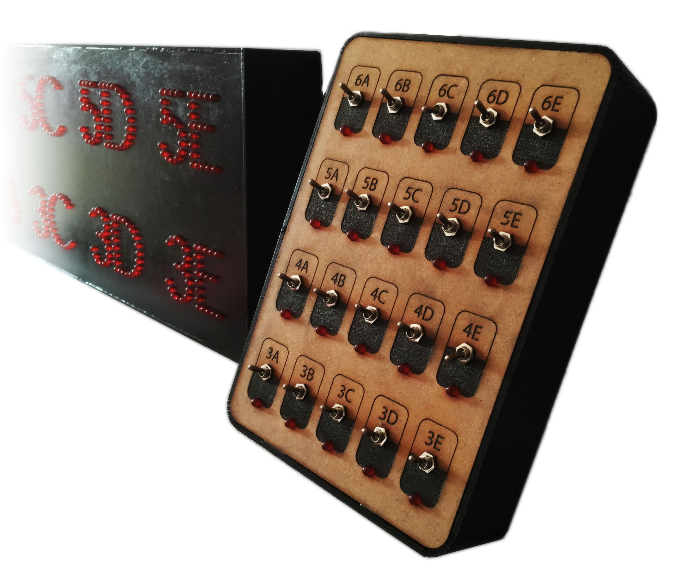
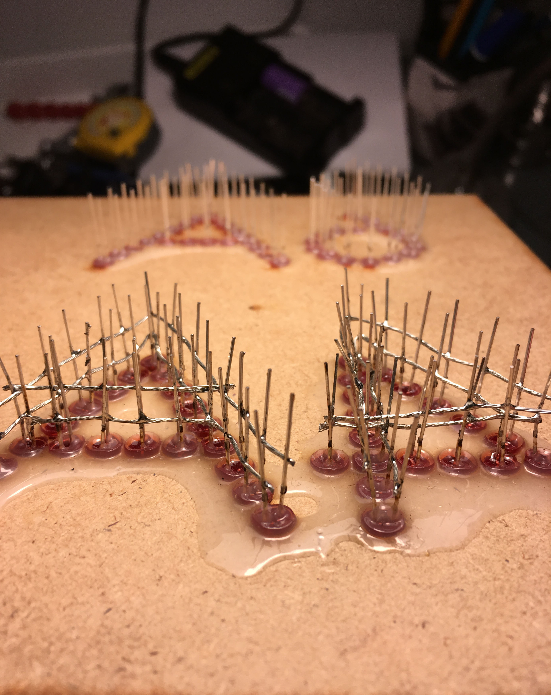
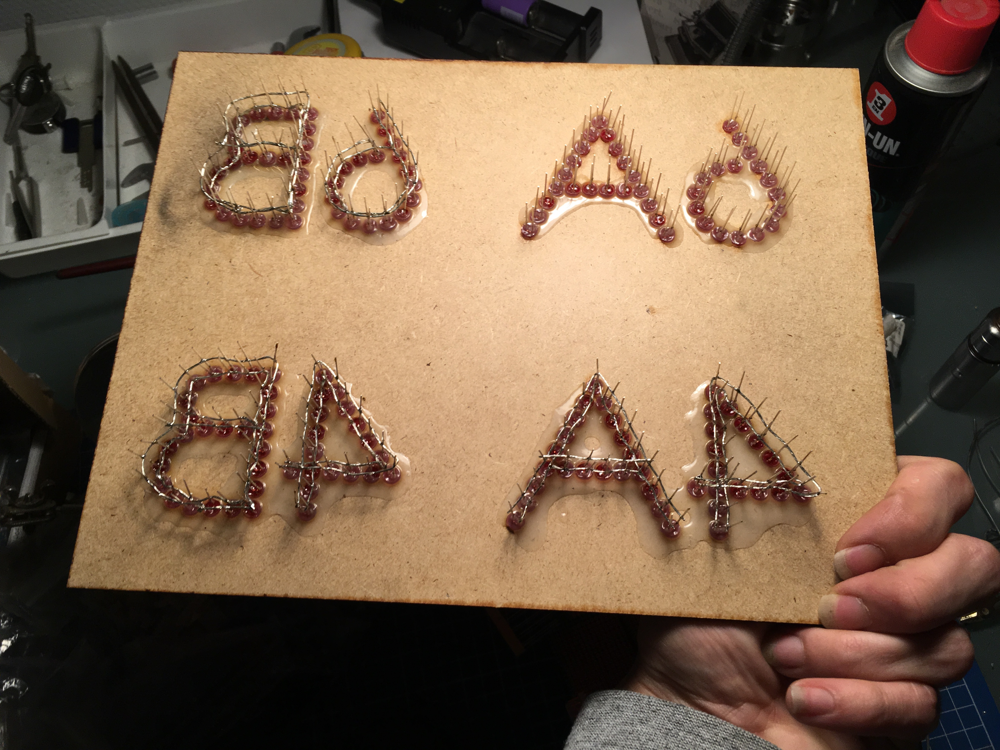
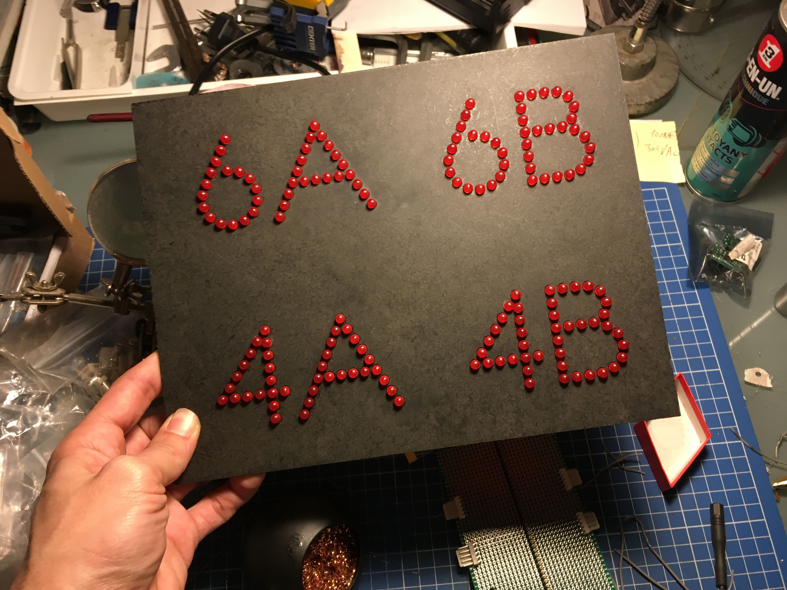
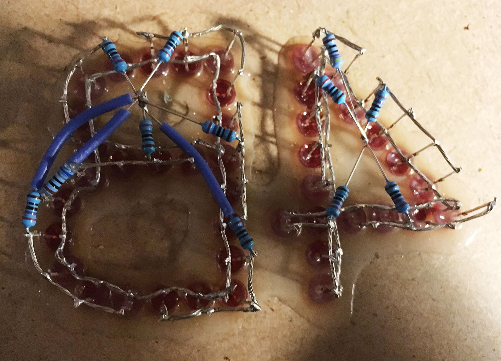
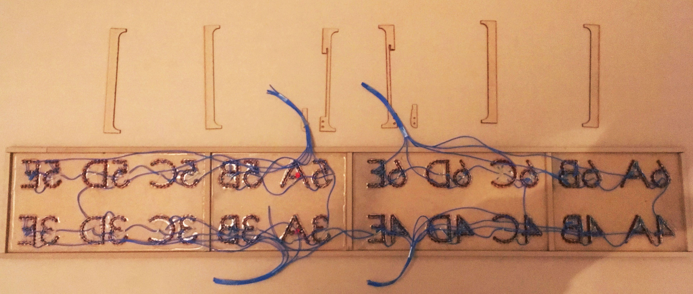
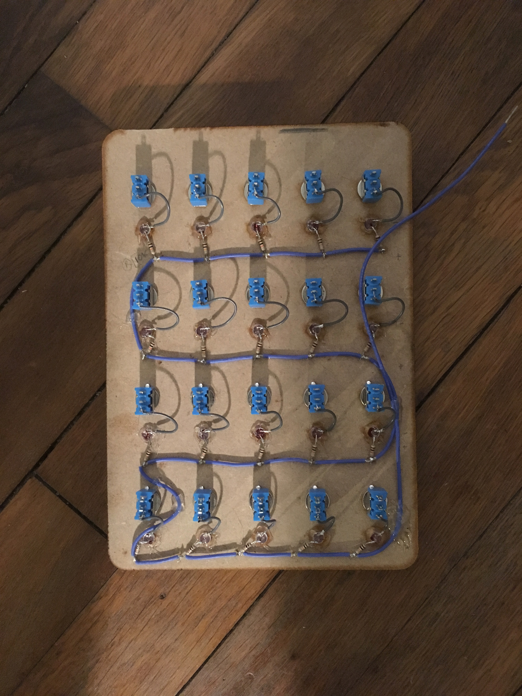

# AFFICHEUR-LED

Un afficheur à diodes électroluminescentes pour faciliter l'appel et la consultation de classes dans une cour d'établissement scolaire.

## Description :

Cet afficheur à diodes electroluminescentes a pour fonction de fournir au service de vie scolaire d'un collège, un support de communication simplifié avec les élèves, en particulier pour l'appel des classes à la cantine ou au réfectoire. Celui-ci par ailleurs, offre aux élèves un moyens aisé de se rapporter aux informations communiquées.
L'appareil affiche alors les classes souhaitées (de la 6eme à la 3eme reparties en classes identifiées de A à E) relativement à un tableau de commande qui transmet par radio-fréquences l'appel effectué.
Les classes appelées sont affichées en rouge et clignotent pendant 5 minutes avant de se stabiliser. Cela afin de distinguer les classes les plus recemments appelées.

## Périphériques :

* Afficheur à diodes electroluminescentes
* Tableau de commande
* Relais

## Caractéristiques techniques :

 • | Afficheur | Tableau de commande | Relais
------------ | ------------ | -------------
Tension de fonctionnement | 220v             | 220v            | 220v
Consommation minimal      | 3 A              | 1 A            | 100 ma
Consommation maximal      | 4 A              | 2 A            | 500 ma
Dimensions (≈)            | 1265mm/260mm/60mm | 225mm/160mm/50mm | ?mm/?mm/?mm
Emission/réception min.   | 100m             | 100m             | 100m
Emission/réception max    | 100m             | 100m             | 100m

## Composition matérielle :

* Afficheur
    * 777x leds 620\~625nm, 150\~200mcd, 1.8\~2.2v, 20mA.
    * 5x Panneaux MDF, A3, épaisseur : 3mm.
    * 3x SN74HC595
    * 20x P2N2222A
    * 10x Connecteur xxxxxxx
    * 1x PCB prototype 90mm/40mm
    * 1x Cable étamé 26 AWG ≈20m
    * 1x Arduino-pro-mini 5V (ATMEGA 328)
    * 1x Récepteur RF 440mhz(HCN67)
    * 1x Antenne (170mm)
    * 200x Resistances 220Ω
    * 1x Transformateur AC/DC, 5V, 8A

* Tableau de commandes
    * 20x led 620\~625nm, 150\~ 200mcd, 1.8\~ 2.2v, 20mA.
    * 1x Arduino-pro-mini 5V (ATMEGA 328)
    * 2x Panneaux MDF, A3, épaisseur : 3mm.
    * 1x L7805
    * 2x CD4051
    * 20x Interupteur (MTS 101)
    * 1x PCB prototype 90mm/40mm
    * 1x Cable étamé 26 AWG ≈1m
    * 1x Emeteur RF 440mhz(HC??)
    * 1x Antenne (170mm)
    * 1x Transformateur AC/DC, 12V, 1A
    
* Relais
    * ?x led 620\~625nm, 150\~ 200mcd, 1.8\~ 2.2v, 20mA.
    * 1x Arduino-pro-mini 5V (ATMEGA 328)
    * 1x L7805
    * 1x PCB prototype ?mm/?mm
    * 1x Récepteur RF 440mhz(HCN67)
    * 1x Emeteur RF 440mhz(HC??)
    * 1x Antenne (170mm)
    * 1x Transformateur AC/DC, 12V, 500mA

## Procédure d'utilisation :
L'utilisation demeure des plus simples : une fois les deux appareils sous tensions, l'activation d'une classe sur le tableau de commandes entreine l'affichage  de la classe correspondante sur le panneau d'affichage. Les classes appellées clignotes pendant cinq minutes avant de resté allumées, afin de distinguer les classes recemment appellées des autres.

## Sécurité et normes :
Si l'appareil est concu pour resister aux projections d'eau et à l'humidité, il n'est pas concu pour etre immergé dans un liquide.

## Notes complementaires :
Cet afficheur fut concu avec les moyens techniques à disposition, à savoir une decoupeuse laser Trotec XXXXX pour le recouvrement qui contraint à une surface de découpe de la taille d'un A3 maximum.
Du coté electronique, là aussi le manque de moyens ont conduit à des choix specifiques. Ainsi, par manque de moyens de gravure de plaque de cuivre, il fut choisis d'utiliser des cartes de prototypage ainsi que des modules plutôt que des composants ( AT-MEGA et  radios-transmeteurs nottament).
L'afficheur serait alors surement d'autant mieux concu s'il pouvait ne pas etre soumis aux contraintes precedement evoquées et donc permettre la decoupe en une seule piece des faces de l'afficheurs, ainsi que de proposer un circuit plus aboutit pour l'electronique.

Pour plusieurs autres raisons diverses, il fut choisis de composer des lettres et chiffres par plusieurs leds juxtaposées. Ce choix conduit à de lourdes opperations de fabrication. De plus, il n'est pas sans augmenter le risque de defaillance du systeme complet puisque, chaque led (777 au total) est portentiellement sujette à un risque de defaillance. Reflechir à un systeme moins complexe mais tout aussi efficace serait alors surement souhaitable dans l'amelioration de cet objet.

Du coté logiciel, des ameliorations sont surement à envisager.

## Versions et mises à jours
L'ensemble est diffusé initialement dans sa version 1.0. C'est cette version qui accompagne l'appareil initialement fabriqué.
Dans le souci de proposer des ameliorations sans contreindre l'utilisation et l'entretient de l'appareil initialement concu, la version 1.0 restera accecible en plus des versions mises a jours.

## Ilustrations

### Panneau d'affichage V 1.0

### Tableau de commandes V 1.0

