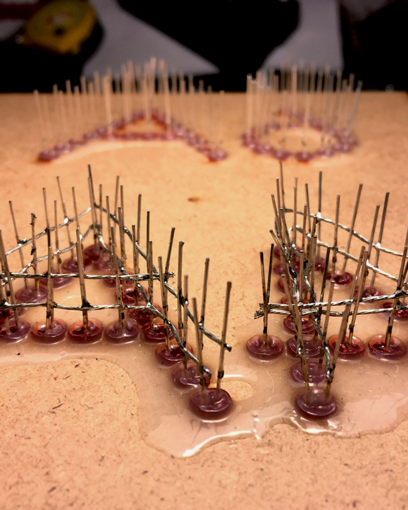
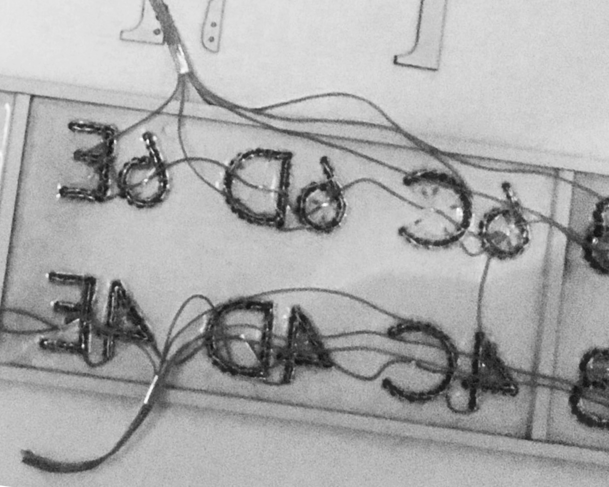
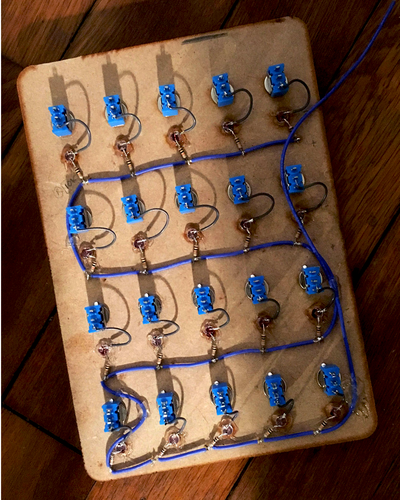

# Élèvage - Afficheur Led.

Un afficheur à diodes électroluminescentes pour faciliter l'appel et la consultation de classes dans une cour d'établissement scolaire du premier cycle du secondaire.

- [Description](#description-)
- [Péripheriques](#périphériques-)
- [Caractéristiques techniques :](caractéristiques-techniques-)
- [Composition matérielle :](#composition-matérielle-)
- [Procédure d'utilisation](#procédure-dutilisation-)
- [Sécurité](#sécurité-)
- [Notes complémentaires](notes-complementaires-)
- [Versions et mises à jours](#versions-et-mises-à-jours)
- [Explications résumée du fonctionnement](#explication-résumée-du-fonctionnement)
- [Illustrations](#illustrations)

## Description :

Cet afficheur à diodes électroluminescentes a pour fonction de fournir au service de vie scolaire d'un collège un support de communication simplifié avec les élèves, en particulier pour l'appel des classes à la cantine ou au réfectoire. Celui-ci par ailleurs, offre aux élèves un moyens aisé de se rapporter aux informations communiquées.
L'appareil affiche alors les classes souhaitées (de la 6eme à la 3eme reparties en classes identifiées de A à E) relativement à un tableau de commande qui transmet par radio-fréquences l'appel effectué.
Les classes appelées sont affichées en rouge et clignotent pendant 5 minutes avant de se stabiliser. Cela afin de distinguer les classes les plus récemment appelées des plus anciennes.

## Périphériques :

* Afficheur à diodes électroluminescentes
* Tableau de commande
* Relais

## Caractéristiques techniques :

 • | Afficheur | Tableau de commande | Relais
------------ | ------------ | ------------- | -------------
Tension de fonctionnement | 220v             | 220v            | 220v
Dimensions (≈)            | 1265mm/260mm/60mm | 225mm/160mm/50mm | ?mm/?mm/?mm
Emission/réception min.   | 100m             | 100m             | 100m
Emission/réception max    | 100m             | 100m             | 100m

## Composition matérielle :

* Afficheur
    * Cable étamé 26 AWG ≈20m
    * 777x leds 620\~625nm, 150\~200mcd, 1.8\~2.2v, 20mA.
    * 5x Panneaux MDF, A3, épaisseur : 3mm.
    * 3x SN74HC595
    * 20x P2N2222A
    * 20x Resistances 1KΩ
    * 4x Connecteur mâle (KF2510)
    * 4x Connecteur femelle (KF2510)
    * 20x Broches à sertirs (KF2510)
    * 1x PCB prototype 120mm/80mm
    * 1x Arduino-pro-mini 5V (ATMEGA 328)
    * 1x Récepteur RF 440mhz (HCN67)
    * 1x Antenne (170mm)
    * 200x Resistances 220Ω
    * 1x Transformateur AC/DC, 5V, 8A

* Tableau de commandes
    * 1x Cable étamé 26 AWG ≈1m
    * 20x led 620\~625nm, 150\~ 200mcd, 1.8\~ 2.2v, 20mA.
    * 1x Arduino-pro-mini 5V (ATMEGA 328)
    * 2x Panneaux MDF, A3, épaisseur : 3mm
    * Cable étamé 26 AWG ≈1m
    * Cable étamé 30 AWG ≈1m
    * 1x L7805
    * 2x CD4051
    * 20x Interupteur (MTS 101)
    * 2x Embases (DC3-10)
    * 2x Connecteurs (FC-10)
    * 1x PCB prototype 90mm/70mm
    * 1x Emeteur RF 440mhz (HC34C)
    * 1x Antenne (170mm)
    * 1x Transformateur AC/DC, 12V, 1A
    
* Relais
    * 2x led 620\~625nm, 150\~ 200mcd, 1.8\~ 2.2v, 20mA.
    * 1x Arduino-pro-mini 5V (ATMEGA 328)
    * 1x L7805
    * 1x PCB prototype 90mm/70mm
    * 1x Récepteur RF 440mhz (HCN67)
    * 1x Emeteur RF 440mhz (HC34C)
    * 2x Antenne (170mm)
    * 1x Transformateur AC/DC, 12V, 500mA

## Procédure d'utilisation :
L'utilisation demeure des plus simples : lorsque les deux appareils sont sous tensions, l'activation d'une classe sur le tableau de commandes allume la classe correspondante sur le panneau d'affichage. Les classes appelées clignotes pendant cinq minutes avant de rester allumées, cela afin de distinguer les classes récemment appelées des plus anciennes.

## Sécurité :
Si l'appareil est conçu pour résister aux projections d'eau et à l'humidité, il n'est pas conçu pour être immergé dans un liquide.

## Notes complémentaires :
Cet afficheur fut conçu avec les moyens techniques à disposition, à savoir une découpeuse laser pour le recouvrement qui contraint à une surface de découpe de la taille d'un A3 maximum.
Du côté électronique, là aussi le manque de moyens ont conduit à des choix spécifiques. Ainsi, à defaut de pouvoir graver un circuit sur une plaque de cuivre, il fut choisi d'utiliser des cartes de prototypage ainsi que des modules plutôt que des composants (AT-MEGA et radios-transmeteurs notamment).
L'afficheur serait alors sûrement d'autant mieux conçu s'il pouvait ne pas être soumis aux contraintes précédemment évoquées et donc permettre la découpe en une seule pièce des faces de l'afficheur, ainsi que de proposer un circuit plus abouti pour l'électronique.

Pour plusieurs autres raisons diverses, il fut choisi de composer des lettres et chiffres par plusieurs leds juxtaposés. Ce choix conduit à de lourdes opérations de fabrication. De plus, il n'est pas sans augmenter le risque de défaillance du système complet puisque, chaque led (777 au total) est potentiellement sujet à un risque de disfonctionnement. Réfléchir à un système moins complexe, mais tout aussi efficace serait alors sûrement souhaitable dans l'amélioration de cet objet.

Du coté logiciel, des améliorations sont sûrement aussi à envisager :
- Inverser les valeurs envoyé et reçu par le récepteur qui sont contraire à l'usage habituel, rendant le code parfois contre-intuitif (en effet, les 0 signifient ouverts et les 1 fermés dans la programmation actuelle)
- Ajouter un système de gestion par le biais du moniteur permettant de modifier le temps de clignotement ou la puissance des leds.
- Synchroniser le clignotement des leds pour l'afficheur

Afin de permettre d'éventuelles améliorations, les fichiers originaux de découpe ainsi que les fichiers correspondant aux circuits imprimé sont disponibles dans ce Git.

## Versions et mises à jours
L'ensemble est diffusé initialement dans sa version 1.0. C'est cette version qui accompagne l'appareil initialement fabriqué.
Dans le souci de proposer des améliorations sans contraindre l'utilisation et l'entretient de l'appareil initialement conçu, la version 1.0 restera acessible en plus des versions mises à jours.
Pour d'éventuelles mises à jour de la programmation des différents ATMEGA, il faudra se munir d'un programmateur UART (sur la base d'un microcontrôleur cp2101 par exemple).

## Explication résumée du fonctionnement.
### Tableau de bord
#### Menuiserie
- Conçu à partir de plans de découpe réalisés par ordinateur, c'est à partir d'une surface limitée à un A3 que fut découpé au laser les éléments du tableau de bord.
- Les interrupteurs, circuits de fils ainsi que les leds incrustés, furent montés sur le panneau avant son assemblage. Cela fait, les autres parties du tableau de bord furent assemblés par collage puis peints avant d'ajouter la face avant et les interrupteurs montés sur celui-ci.
#### Électronique
- 20 circuits sous tensions comprenant une led et un interrupteur constitue chaque boutons correspondant à chaque classe du tableau de bord.
- Sur chacun de ces circuits, un raccord à une broche du microcontrôleur (ATMEGA325) est effectué.
- Le microcontrôleur ne comprenant pas assez d'entrés/sorties, il fut choisi d'utiliser un multiplexeur/demultiplexeur (CD4051 ou SN74HC595) permettant par quelques broches de commander ou recevoir plusieurs signaux.
- Chaque signaux reçu par le microcontrôleur est rapporté à un bit nul ou positif (ouvert ou fermé) identifiant chaque classe à allumer ou éteindre.
- Ces signaux mémorisés dans un tableau, sont envoyés par le module de radio-frequence (À l'aide de la bibliotheque [VirtualWire](http://www.airspayce.com/mikem/arduino/VirtualWire.pdf))
### Afficheur
#### Menuiserie
- Conçu à partir de plans de découpe réalisés par ordinateur, c'est à partir d'une surface limitée à un A3 que fut découpé au laser les éléments de l'afficheur.
- Dans un premier temps, les éléments structurels de l'afficheur furent peints, puis les leds ajoutés sur les éléments de la façade de l'afficheur avant d'êtres englués pour les maintenir en place.
- Des fils dénudés furent ensuite glissés entre les différentes anodes puis cathode des leds avant de souder ces fils pour raccorder les leds entres elles (par groupe de 4 leds monté en série). Est ensuite soudé des fils aux différents groupes de leds pour permettre leurs raccordements au microcontrôleur.
- À l'aide de tasseau de 10x10mm placés aux arêtes de l'afficheur, les différents éléments de la façade sont rassemblés et collés.
- L'ensemble est vernis et raccordé à l'électronique.
#### Électronique
- 20 circuits sous tensions correspondant à chaque classe et comprenant en moyenne 30 leds répartie en séries de 4 leds rassemblés en parallèles. Chacun de ces circuits est ouvert et comporte un fil qui une fois raccordé à l'anode du générateur permet fermer le circuit et donc d'afficher la classe correspondante.
- Chacun de ces fils est raccordé au collecteur d'un transistor (P2N2222A) qui a son émetteur raccordé à l'anode du générateur. En alimentant ou non la base du transistor, on peut alors utiliser celui-ci comme interrupteur électronique.
- Chaque base de chaque transistor (20 en tout) est raccordée à une borne du microcontrôleur par le biais d'un multiplexeur/demultiplexeur.
- De ce, à la réception du signal, chaque transistor est alimenté ou non à sa base selon l'information recu (0 ou 1).

## Illustrations
### Panneau d'affichage V 1.0
     
### Tableau de commandes V 1.0
 
### Mise en situation dans un collège de région tourangelle

